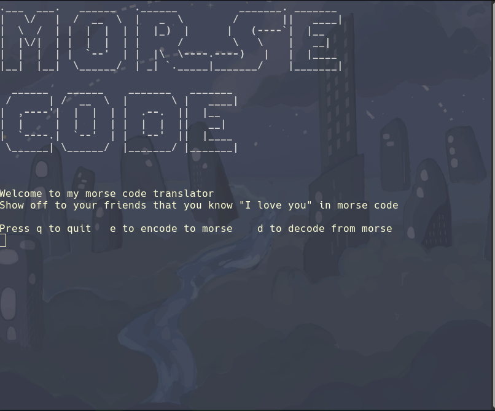

# Morse Code encoder

 
A simple terminal based morse code encoder written in python.
Decoding functionality will be added soon.

For initial setup (windows):

    py -m venv venv
    ./venv/Scripts/activate
    py -m pip install -r requirements.txt

You can then run the program in your terminal with:

    py ./main.py
    
for linux activate the virtual environment with:

    source venv/bin/activate
  
    

